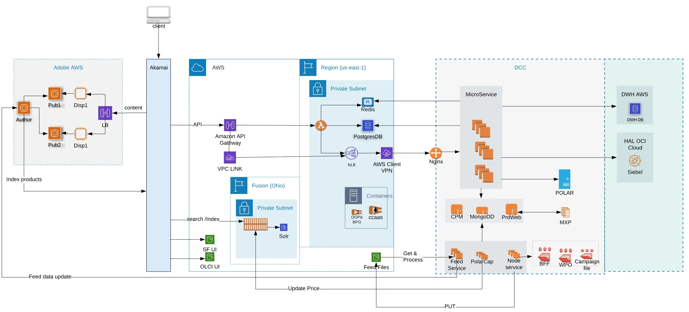
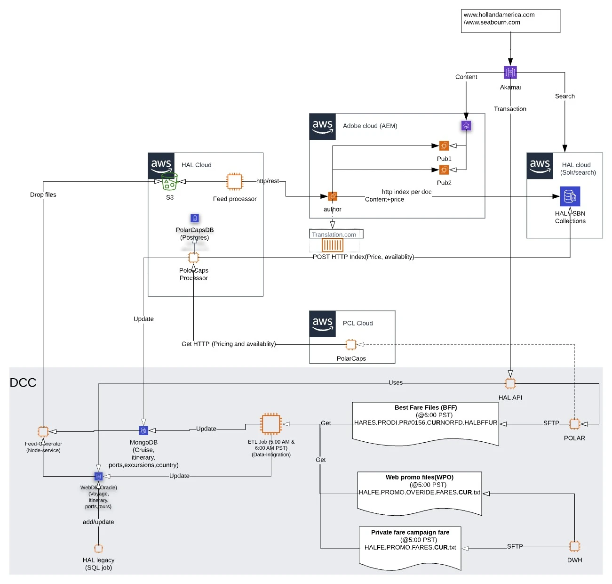
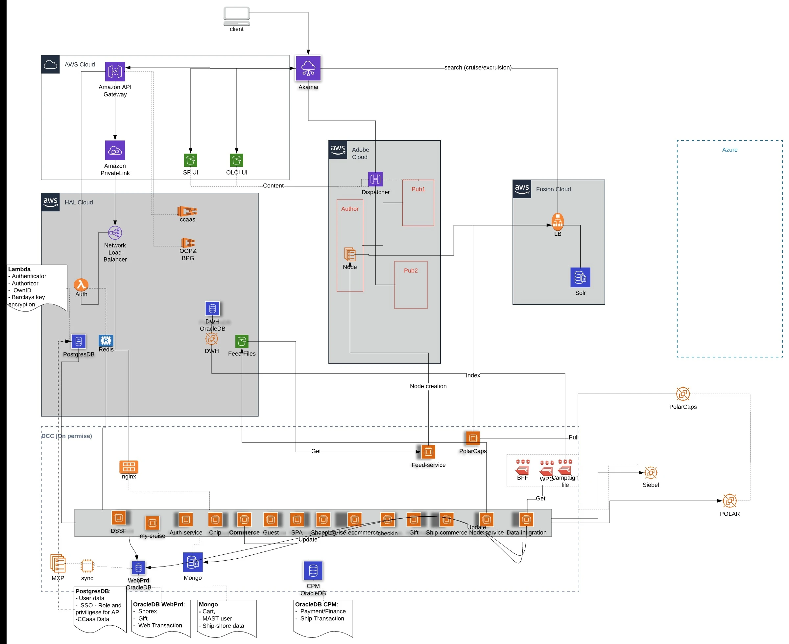
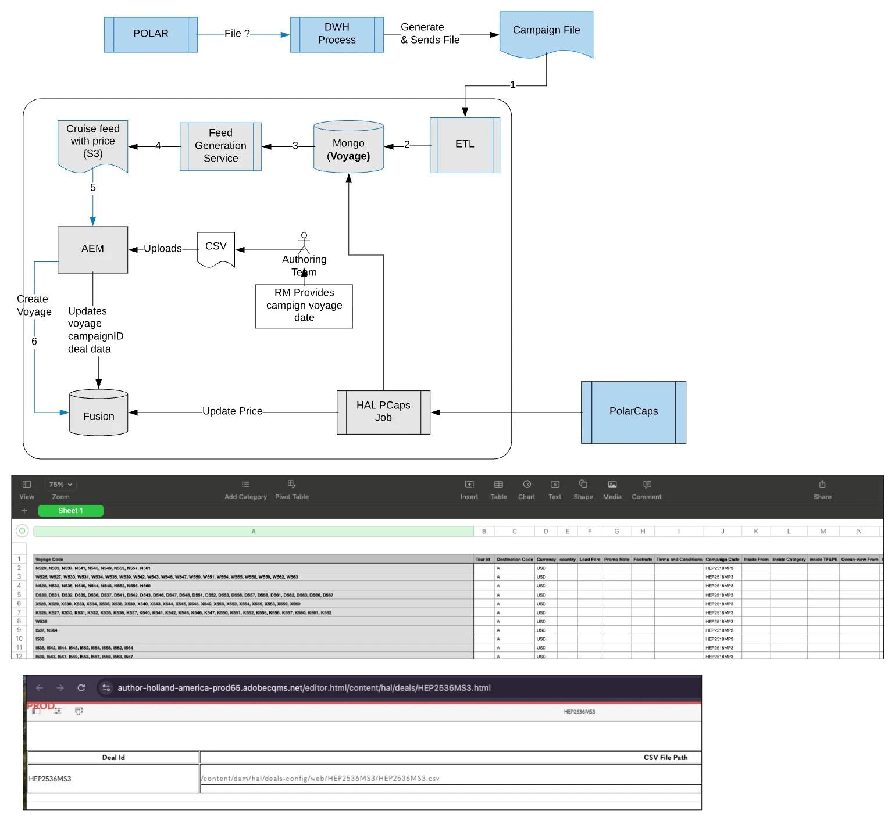

# HAL Content Hierarchy — /content/hal/global/en

```
[1] /content/hal/global/en
│
├── [2] find-a-cruise
│   ├── [2.1] c5s11a              ← itinerary
│   │   └── [2.1.1] d523         ← cruise
│   ├── [2.2] h5h24b             ← itinerary
│   │   └── [2.2.1] k521a        ← cruise
│   └── [2.3] a5s07br6l          ← itinerary
│       ├── [2.3.1] i539         ← cruise
│       ├── [2.3.2] n545         ← cruise
│       └── [2.3.3] i563         ← cruise
│
├── [3] cruise-destinations                      
│   └── [3.1] alaska-cruises.                       ← destinations
│       └── [3.1.1] alaska-yukon-ports              ←  Ports
│           ├── [3.1.1.1] yvr                       ← PortId
│           │   └── [3.1.1.1.1] 43718               ← Excursion
│           │       └── [3.1.1.1.1.1] 1010112807    ← Child Excursions
│           └── [3.1.1.2] vancouver-b-c-ca-yvr
│   └── [3.2] caribbean-cruises
│
├── [4] cruise-ships                               ← Parent Ship folder
│   ├── [4.1] zaandam                              ← Induvidual Ships
│   │   └── [4.1.1] 7                              ← Ship version. Can be more at a point
│   │       └── [4.1.1.1] rooms                    ← Rooms place holder. 
│   │           ├── [4.1.1.1.1] aa-vs-vista-suite. ← Room type
│   │           │   └── vista-suite                ← Room name
│   │           ├── [4.1.1.1.2] aa-ov-ocean-view
│   │           │   ├── partial-sea-view
│   │           │   └── ocean-view
│   │           └── [4.1.1.1.3] aa-ns-neptune-suite
│   │               └── neptune-suite
│   └── [4.2] nieuw-amsterdam
│       └── [4.2.1] 4
│           └── [4.2.1.1] rooms
│               └── [4.2.1.1.1] na-vn-verandah
│                   └── spa-verandah
│
└── [5] faq
    └── [5.1] cruise-planning
        ├── [5.1.1] packaging-and-luggage
        │   ├── [5.1.1.1] how-should-i-pack-for-alaska
        │   ├── [5.1.1.2] do-i-need-baggage-insurance
        │   └── [5.1.1.3] musical-instruments
        └── [5.1.2] holiday-and-special-events
            └── [5.1.2.1] what-if-a-member-of-the-wedding-party-or-a-guest-has-special-needs
```

---

## Descriptions

| Index | Description |
|-------|-------------|
| [1] | Home page — built from static components. Accessed via `www.hollandamerica.com/en/us` |
| [2] | Find-a-Cruise page — populated via Fusion search results. Filters are also dynamically populated. See: `www.hollandamerica.com/en/us/find-a-cruise` |
| [2.1], [2.2], [2.3] | Itineraries — created from feed data. Change on a day-to-day basis. Hold itinerary data but do not have a standalone page of their own. |
| [2.1.1], [2.2.1], [2.3.1], [2.3.2], [2.3.3] | Cruises — individual cruise pages under an itinerary. Example: `https://www.hollandamerica.com/en/us/find-a-cruise/e6ne14/j646b` |
| [3] | Cruise Destinations — mix of manually created pages and feed-created pages. |
| [3.1], [3.2] | Feed-created pages, but manually edited by adding static components. https://www.hollandamerica.com/en/us/cruise-destinations/alaska-cruises|
| [3.1.1] | Manually created page with some static components. https://www.hollandamerica.com/en/us/cruise-destinations/alaska-cruises/alaska-wildlife|
| [3.1.1.1], [3.1.1.2] | Created via feed process. |
| [3.1.1.1.1] | Excursion pages — feed created. https://www.hollandamerica.com/en/us/cruise-destinations/alaska-cruises/alaska-yukon-ports/jnu/23022|
| [3.1.1.1.1.1] | Child excursion pages — feed created. ~8000 pages with daily additions, deletions, and updates. The content of this child excursion is shwon under the parent page.  https://www.hollandamerica.com/en/us/cruise-destinations/alaska-cruises/alaska-yukon-ports/jnu/23022|
| [4] | Cruise Ships — parent folder for all ship-related data. |
| [4.1], [4.2] | Ship name (e.g., Zaandam, Nieuw Amsterdam) — created via feed process. |
| [4.1.1], [4.2.1] | Ship version — a ship can have multiple versions. https://www.hollandamerica.com/en/us/cruise-ships/eurodam/0|
| [4.1.1.1], [4.2.1.1] | Rooms — placeholder node for all room types available on that ship version. The room information is shown in the ship page. https://www.hollandamerica.com/en/us/cruise-ships/eurodam/0 |
| [4.1.1.1.1], [4.1.1.1.2], [4.1.1.1.3] | Room types — created by feed. Authors add additional static info on these pages. |
| [5] | FAQ — parent folder for all frequently asked questions. All pages below are manually authored. |
| [5.1] | FAQ category (e.g., cruise-planning) — manually created. |
| [5.1.1], [5.1.2] | FAQ subcategories (e.g., packaging-and-luggage, holiday-and-special-events) — manually created. |
| [5.1.1.1], [5.1.1.2], [5.1.1.3], [5.1.2.1] | Individual FAQ pages — manually authored by content editors. |

> **Note:** All feed-created pages undergo Add, Delete, and Update operations on an ongoing basis.


HAL & SBN Web Architecture Diagrams (Network Diagrams) 







CSV Process file: This process is the established way to create new deals and is tightly 
integrated with Fusion Search Engine.
